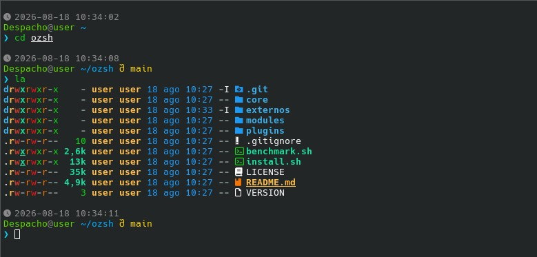

# ozsh

Modular **Zsh** configuration aimed at system administrators, DevOps engineers, and advanced Linux users.

The goal of **ozsh** is to provide a fast, maintainable, and predictable working environment, avoiding heavy frameworks and keeping a simple architecture based on independent modules.


🌐 **Languages:** [Español](README.md) | English

---

## 🚀 Features

### Prompt

* Clean two-line design.
* Date and time.
* Execution time of the last command.
* Visible exit code.
* SSH session indicator.
* Root user detection.
* Git branch and status.
* Python virtual environment.
* Docker project detection.

### User experience

* Advanced autocompletion.
* Fish-style autosuggestions.
* Real-time syntax highlighting.
* FZF integration.
* Smart navigation via Zoxide.
* Automatic Direnv integration.
* Modern replacement for `ls` via Eza.
* Enhanced file viewing via Bat.

---

## 🧠 Philosophy

ozsh follows three core principles:

* **The prompt never computes information.**
* **State is updated through hooks.**
* **Each module has a single responsibility.**

This keeps the prompt fast and easy to maintain.

---

## ❓ Why ozsh?

There are excellent frameworks out there, such as Oh My Zsh, Prezto, Zinit, or Antidote.

ozsh takes a different approach.

Instead of providing hundreds of plugins and layers of abstraction, it focuses on offering a small, modular, and fully explicit configuration.

Each file has a single responsibility, and all the code can be easily understood without needing to learn a framework.

---

## 📋 Requirements

The project currently officially supports:

* Debian 13 and its derivatives.
* Fedora 42 and related distributions.
* Internet connection during installation.

---

## 🔤 Recommended font

ozsh uses **Nerd Fonts** icons to represent system status and improve prompt readability.

Recommended:

* **JetBrainsMono Nerd Font**

Without a Nerd Font installed, the configuration will still work correctly, but some icons will show up as unrendered Unicode characters.

---

## ⚙️ Installation

```bash
git clone https://github.com/Orencio-Ramirez/ozsh.git "$HOME/ozsh"

cd "$HOME/ozsh"

chmod +x install.sh

./install.sh
```

The installer:

* Automatically detects the operating system.
* Installs the required dependencies.
* Downloads or updates external plugins.
* Generates a clean `.zshrc`.
* Sets Zsh as the default shell.
* Can be run multiple times safely.

After installation, it's recommended to log out and log back in.

---

## 📦 Dependencies

### Installed via the package manager

* zsh
* git
* curl
* fzf
* eza
* bat
* direnv
* zoxide

### External plugins

* zsh-completions
* zsh-autosuggestions
* zsh-syntax-highlighting
* zsh-history-substring-search

---

## 📁 Project structure

```text
ozsh/

├── core/          # Base configuration
├── modules/       # Prompt modules
├── plugins/       # Tool integrations
├── externos/      # Automatically downloaded plugins
├── media/         # Graphic assets (screenshots, etc.)
├── install.sh
├── LICENSE
├── README.md
└── VERSION
```

---

## ⚡ Performance

The main goal of ozsh is to keep the prompt fast, with a constant cost.

## 🏗️ Design

### Avoided

* Heavy frameworks.
* Logic inside the prompt.
* Monolithic code.
* Unnecessary dependencies.

### Prioritized

* Modularity.
* Simplicity.
* Readability.
* Low resource usage.
* Long-term maintainability.

---

## 🎨 Customization

The main visual elements can be modified from:

```text
core/colors.zsh
core/icons.zsh
```

The configuration is organized by responsibility, making it easy to add, remove, or modify modules.

---

## 🖥️ Preview



```text
󰥔 2026-06-28 22:41:12   ⏱ 1.24s   ✘127   󰌘 SSH

user ~/projects/homelab   main*  🐍 venv  🐳
❯
```

---

## 📌 Project status

ozsh is under active development.

The main goals of the project are:

* Speed.
* Modularity.
* Reproducibility.
* Easy-to-maintain code.
* A working environment aimed at system administration and DevOps.

---

## 📄 License

This project is distributed under the terms of the **GNU General Public License v3.0 (GPL-3.0)**.
